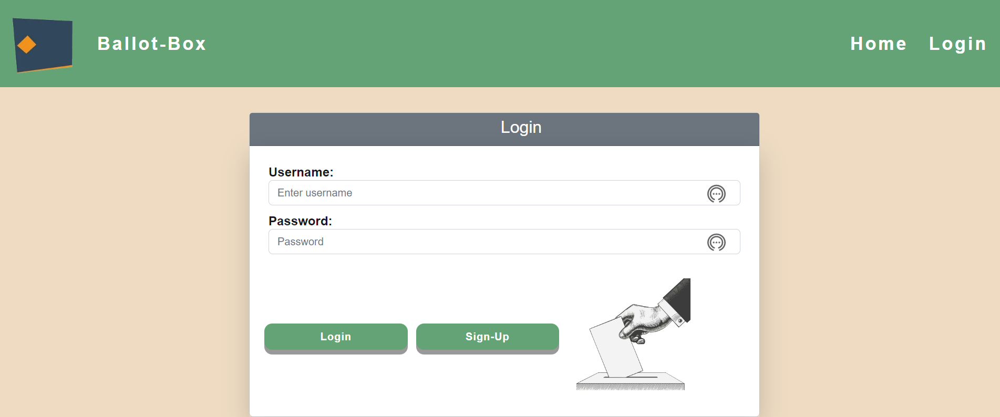
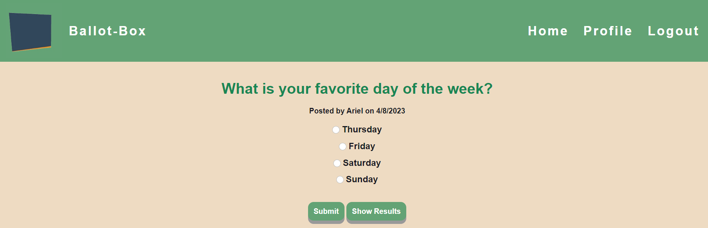
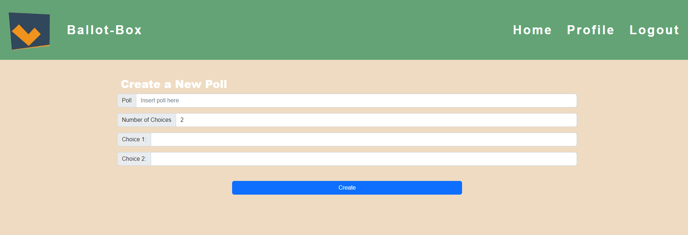

# ⭐ Ballot-Box ⭐

## Description ✏️

Join Ballot-Box and make your opinion count! 
This is a poll application, when opened, the user is presented with options for a poll.   
After clicking on one of the poll options, poll results appear on the screen in real-time. 
In addition, the user can create a poll and share the link with others.   
The user can delete a poll, if they would like. 

## User Story 📖

AS A fair individual user,
I WANT to be able to poll users,
SO THAT I can reach an agreed solution.

## Table of Contents 📖

- [Installation](#installation)
- [Usage](#usage)
- [Tests](#tests)
- [Badges](#badges)
- [Credits\_&_Questions](#credits_&_questions)
- [License](#license)
- [Features](#features)

## Installation 🔑

1.  `Node.js` is required to run this application,
2.  `npm & MySQL` will need to be installed as well.

## Usage &#128161;

[Repository link:](https://github.com/ttieman/Ballot-Box)

This can be used for any type of poll, so as to help reach a majority solution.

## Screenshot 🎯

## Tests 🎯

&nbsp; None

## Badges 🏆

## Credits & Questions 👈

Our Team:

Chel Freitas https://github.com/123sites

Ariel Schwartz https://github.com/arishorts

Tanner Tieman https://github.com/ttieman

## License 📝

The MIT license is in the GitHub repository. Click to link to view it:
[MIT License](https://github.com/123sites/Blog-Site/blob/main/LICENSE)

## Features ✍

- ESLint
- Heroku
- Express
- Sequelize
- An MVC file structure
- Coolors color palette
- Polished UI that's responsive
